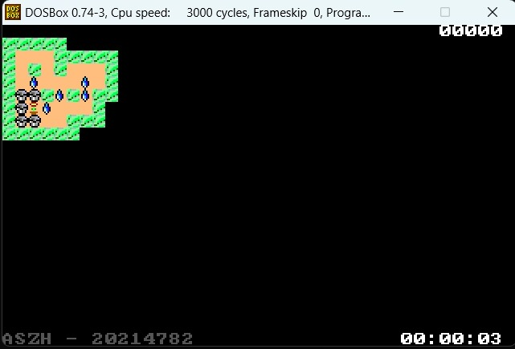

# **MANUAL DE USUARIO**

Para la presente actividad se le solicita el desarrollo de un juego sencillo empleando las características gráficas que brinda DOS y el conjunto de interrupciones que este provee.

Junto a este juego, se desarrollará la interfaz que permitirá manejarlo, el manejo de puntajes más altos, carga de niveles y configuración de controles.

El juego a desarrollar es el juego japonés Sokoban, en el cual el jugador tiene como principal objetivo empujar una serie de cajas hasta conseguir que éstas se ubiquen en ciertas posiciones. Cuando el jugador consigue lo anterior se le permite avanzar de nivel y acumular más puntos.

También se contabilizará el tiempo del jugador en cada partida, dato que también será asociado a la puntuación obtenida por el jugador.

## **Introducción**
___

El presente manual técnico proporciona una guía exhaustiva sobre el desarrollo y funcionamiento de nuestro proyecto de simulación del juego Sokoban, implementado en lenguaje ensamblador. Este juego clásico, conocido por su ingenio y desafío, ha sido recreado en un entorno digital, ofreciendo a los jugadores una experiencia entretenida y estimulante.

Nuestro proyecto se ha desarrollado con el objetivo de recrear fielmente la mecánica y las reglas del Sokoban original, manteniendo su esencia y desafío. A través del uso del lenguaje ensamblador, hemos logrado una implementación eficiente y optimizada que permite una ejecución rápida y fluida del juego, brindando una experiencia de juego inmersiva para los usuarios.

Este manual técnico está diseñado para proporcionar una visión general completa del proyecto, desde su instalación y configuración hasta la explicación detallada de sus características y funcionalidades. Se presenta una descripción detallada del diseño y la arquitectura del sistema, así como información sobre las estructuras de datos utilizadas y los algoritmos implementados.

Además, se incluyen instrucciones detalladas sobre cómo utilizar el juego, incluyendo las acciones disponibles para los jugadores, las reglas del juego y las indicaciones sobre cómo resolver los diferentes niveles de Sokoban. También se ofrecen recomendaciones para optimizar el rendimiento del juego y solucionar posibles problemas o errores.

Esperamos que este manual técnico sea una herramienta útil tanto para aquellos interesados en comprender la implementación del juego Sokoban en lenguaje ensamblador como para los jugadores que deseen disfrutar de esta divertida experiencia. Siéntete libre de explorar cada sección y utilizar este manual como referencia durante tu interacción con el juego.

## **Instalación**
___

Para instalar el software de ingreso de productos y realización de ventas en tu sistema, sigue los siguientes pasos:

* Descarga el archivo de instalación desde el sitio web oficial o la fuente confiable.
* Ejecuta el archivo de instalación haciendo doble clic en él.
* Sigue las instrucciones del asistente de instalación para seleccionar el idioma y la ubicación de instalación.
* Acepta los términos y condiciones de la licencia.
* Personaliza las opciones de instalación según tus preferencias.
* Haz clic en "Instalar" para comenzar la instalación.
* Espera a que se complete la instalación. Puede llevar algunos minutos.
* Una vez finalizada la instalación, haz clic en "Finalizar" para cerrar el asistente.

Una vez que hayas completado la instalación, el software estará listo para su uso. Antes de comenzar a utilizarlo, asegúrate de configurar las opciones necesarias, como la creación de una base de datos, la configuración de usuarios y permisos, y la importación de datos existentes si corresponde.

Si encuentras algún problema durante el proceso de instalación o necesitas ayuda adicional, consulta la documentación proporcionada o comunícate con nuestro equipo de soporte técnico.

## **Guía de Uso**
___

En esta sección, se proporciona una guía detallada sobre cómo utilizar el software del juego, su manejo y sus instrucciones para que el usuario le sea facil el acceso y manipulacion del mismo:

1. **Abrir programa**

    Al iniciar el juego, el usuario podra visualizar un menu en el que se encuentran distintas opciones que le permitiran al usuario poder acceder a cada una de ellas:

    

    Al ingresar a esta ventana, se visualiza cada una delas opciones que ofrece el juego, como cargar nivel, iniciar juego, configuracion de controles, ver los puntajes y salir.

    En la parte inferior de esta ventana se observa los datos del creador de dicho juego, de una manera interactiva sin lastimar el ojo del usuario

    Para movilizarse dentro del menu, basta con utilizar las flechas direccionales del teclado para ir hacia arriba o hacia abajo y para seleccionar alguna de las opciones es necesario presionar la tecla F1, y de esta manera podra acceder a alguna de las opciones del menu.

2. **Iniciar juego:**

    Al presionar F1, en la primera opcion del juego, automáticamente accedera a lo que son 3 niveles por defecto del juego, donde el usuario podra jugar de manera interactiva

    

3. **Reglas del juego**

    Las regla del juego son sencillas y fáciles:
    - El usuario podra controlar un jugador el cual se representa con una flor en pantalla, dicha flor puede ser movida hacia arriba, abajo, derecha o izquierda
    - Objetivos: Los objetivos del juego son las cubetas que se encuentran dentro del mapa
    - Objetos: Las gotas de agua que se encuentra visibles en el mapa, son los objetos que la flor debe mover
    - Arbustos: Los arbustos alrededor de todo el mapa, restringe el movimiento del jugador, hacia los lados para que este restringido su movimiento
    
    - Si el usuario en juego, presionase la tecla F2, este automaticamente accedera al menu de pausa, en el que simplemente el podra decidir si continuar o salir de la partida, teniendo en cuenta que al salir de la partida se perdera el progreso y debera iniciar desde el primer nivel nuevamente

        

    - ¿Cómo Ganar?:
        Para ganar en dicho juego, el jugador debera llevar hacia cada una de las cubetas que se encuentran en el juego, una gota de agua, y una vez el usuario haya completado esta accion, automaticamente pasara al siguiente nivel y de esta manera funciona todo el sistema del juego.
    
        

4. **Ventana de juego:**

    Dentro de la ventana del juego, se encuentran las siguientes estadisticas:

    - Mapa del juego: El cual es donde se visualiza el juego como la imagen anterior vista
    - Cronometro: En la parte inferior de la ventana se encuentra un cronometro que notifica al jugador cuanto tiempo ha pasado en un nivel, contando minutos, horas y segundos

        

    - Movimientos: En la parte superior derecha se encuentra un sistema de conteo de movimientos, el cual cuenta cuantos movimientos ha realizado el jugador dentro del mapa

        

5. **Niveles:**

    El juego cuenta con 3 niveles por defecto, los cuales se visualizan una vez hayan completado uno tras uno los niveles:

    - Nivel 1:

        
    
    - Nivel 2: 

        
    
    - Nivel 3:

        

6. **Cargar Nivel**
    Al Presionar en la opcion de cargar nivel, se abrira una ventana en la que el usuario podra ingresar el nombre de algun archivo que contenga algun nivel extra o arbitrario, y basta con escribir su nombre y su extencion y presionar enter, en caso que el archivo no exista simplemente regresara al menu principal

    